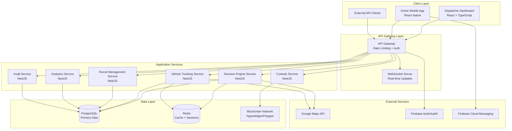

# Design Document: Post-Dispatch Consolidation Platform (PDCP)

## Overview

The Post-Dispatch Consolidation Platform (PDCP) is a distributed B2B SaaS system that optimizes last-mile logistics by intelligently consolidating late-arriving parcels with vehicles already on the road. The system employs a microservices architecture with real-time decision-making capabilities, blockchain-based custody tracking, and comprehensive audit trails.

The platform serves three primary user types: dispatchers managing operations through a web dashboard, drivers using mobile applications for route management, and logistics coordinators monitoring system performance and compliance.

## Architecture

### High-Level Architecture



### Service Architecture

The system follows a microservices pattern with clear separation of concerns:

- **Decision Engine Service**: Core consolidation logic and scoring algorithms
- **Vehicle Tracking Service**: Real-time location and capacity management
- **Parcel Management Service**: Parcel lifecycle and assignment management
- **Custody Service**: Blockchain integration for tamper-proof custody records
- **Analytics Service**: Impact measurement and reporting
- **Audit Service**: Comprehensive logging and compliance tracking

## Components and Interfaces

### Decision Engine Service

**Core Responsibilities:**
- Evaluate late/overflow parcels against available vehicles
- Apply hard and soft constraints
- Generate weighted scores for vehicle-parcel assignments
- Support shadow mode operation

**Key Interfaces:**
```typescript
interface DecisionRequest {
  parcelId: string;
  pickupLocation: GeoCoordinate;
  deliveryLocation: GeoCoordinate;
  slaDeadline: Date;
  weight: number;
  dimensions: Dimensions;
  priority: Priority;
}

interface DecisionResponse {
  recommendedVehicleId?: string;
  score: number;
  explanation: DecisionExplanation;
  alternatives: VehicleOption[];
  requiresNewDispatch: boolean;
}

interface DecisionExplanation {
  hardConstraints: ConstraintResult[];
  softConstraints: ConstraintResult[];
  scoringFactors: ScoringFactor[];
  riskAssessment: RiskAssessment;
}
```

**Scoring Algorithm:**
The decision engine uses a weighted scoring model:
- Route efficiency (30%): Additional distance and time impact
- Capacity utilization (25%): Optimal loading without overloading
- SLA safety margin (25%): Buffer time to ensure delivery commitments
- Vehicle eligibility (20%): Driver performance and vehicle suitability

### Vehicle Tracking Service

**Core Responsibilities:**
- Real-time GPS tracking with 30-second update intervals
- Capacity management for 2W and 4W vehicles
- Route optimization and ETA calculations
- Offline capability support

**Key Interfaces:**
```typescript
interface Vehicle {
  id: string;
  type: VehicleType; // '2W' | '4W'
  driverId: string;
  currentLocation: GeoCoordinate;
  capacity: VehicleCapacity;
  currentRoute: RoutePoint[];
  status: VehicleStatus;
  lastUpdated: Date;
}

interface VehicleCapacity {
  maxWeight: number;
  maxVolume: number;
  currentWeight: number;
  currentVolume: number;
  utilizationPercentage: number;
}
```

### Parcel Management Service

**Core Responsibilities:**
- Parcel lifecycle management
- Assignment tracking and updates
- SLA monitoring and alerting
- Integration with external logistics systems

**Key Interfaces:**
```typescript
interface Parcel {
  id: string;
  trackingNumber: string;
  sender: ContactInfo;
  recipient: ContactInfo;
  pickupLocation: GeoCoordinate;
  deliveryLocation: GeoCoordinate;
  slaDeadline: Date;
  weight: number;
  dimensions: Dimensions;
  status: ParcelStatus;
  assignedVehicleId?: string;
  custodyChain: CustodyRecord[];
}
```

### Custody Service

**Core Responsibilities:**
- Blockchain integration for immutable custody records
- Digital signature verification
- Custody chain validation
- Multi-blockchain support (Hyperledger Fabric / Polygon Edge)

**Key Interfaces:**
```typescript
interface CustodyRecord {
  id: string;
  parcelId: string;
  fromParty: string;
  toParty: string;
  timestamp: Date;
  location: GeoCoordinate;
  digitalSignature: string;
  blockchainTxHash: string;
  verified: boolean;
}

interface CustodyTransfer {
  parcelId: string;
  fromParty: string;
  toParty: string;
  location: GeoCoordinate;
  signature: string;
  metadata: Record<string, any>;
}
```

## Data Models

### Core Entities

**Vehicle Entity:**
```typescript
interface VehicleEntity {
  id: string;
  registrationNumber: string;
  type: VehicleType;
  driverId: string;
  capacity: VehicleCapacity;
  currentLocation: GeoCoordinate;
  status: VehicleStatus;
  eligibilityScore: number;
  createdAt: Date;
  updatedAt: Date;
}
```

**Parcel Entity:**
```typescript
interface ParcelEntity {
  id: string;
  trackingNumber: string;
  senderId: string;
  recipientId: string;
  pickupAddress: Address;
  deliveryAddress: Address;
  pickupLocation: GeoCoordinate;
  deliveryLocation: GeoCoordinate;
  slaDeadline: Date;
  weight: number;
  dimensions: Dimensions;
  value: number;
  status: ParcelStatus;
  assignedVehicleId?: string;
  assignedAt?: Date;
  createdAt: Date;
  updatedAt: Date;
}
```

**Decision Entity:**
```typescript
interface DecisionEntity {
  id: string;
  parcelId: string;
  requestTimestamp: Date;
  recommendedVehicleId?: string;
  score: number;
  explanation: DecisionExplanation;
  shadowMode: boolean;
  executed: boolean;
  overridden: boolean;
  overrideReason?: string;
  overrideUserId?: string;
  createdAt: Date;
}
```

### Database Schema Design

**PostgreSQL Tables:**
- `vehicles`: Vehicle master data and current status
- `parcels`: Parcel information and assignment status
- `decisions`: Decision engine results and explanations
- `routes`: Vehicle route information and waypoints
- `users`: System users (dispatchers, drivers, admins)
- `audit_logs`: Comprehensive audit trail
- `analytics_metrics`: Aggregated performance metrics

**Redis Cache Structure:**
- `vehicle:location:{vehicleId}`: Real-time location data
- `vehicle:capacity:{vehicleId}`: Current capacity information
- `parcel:pending`: Queue of parcels awaiting assignment
- `session:{sessionId}`: User session data
- `decision:cache:{hash}`: Cached decision results

### Blockchain Data Model

**Custody Chain Structure:**
```json
{
  "parcelId": "string",
  "custodyRecords": [
    {
      "recordId": "string",
      "fromParty": "string",
      "toParty": "string",
      "timestamp": "ISO8601",
      "location": {
        "latitude": "number",
        "longitude": "number"
      },
      "digitalSignature": "string",
      "metadata": "object"
    }
  ],
  "chainHash": "string",
  "verified": "boolean"
}
```

## Correctness Properties

*A property is a characteristic or behavior that should hold true across all valid executions of a system-essentially, a formal statement about what the system should do. Properties serve as the bridge between human-readable specifications and machine-verifiable correctness guarantees.*

After analyzing the acceptance criteria, I've identified the following testable properties while eliminating redundancy. Some properties have been consolidated where they test similar behaviors or where one property implies another.

### Decision Engine Properties

**Property 1: Complete Vehicle Evaluation**
*For any* late or overflow parcel and any set of vehicles currently on road, the Decision_Engine should evaluate the parcel against all eligible vehicles in the fleet
**Validates: Requirements 1.1**

**Property 2: Hard Constraint Enforcement**
*For any* parcel assignment recommendation, the Decision_Engine should never violate hard constraints for vehicle capacity or SLA safety margins
**Validates: Requirements 1.2, 6.2**

**Property 3: Multi-Vehicle Ranking Consistency**
*For any* parcel with multiple eligible vehicles, the Decision_Engine should rank them consistently using weighted scoring based on route efficiency, capacity utilization, and delivery time impact
**Validates: Requirements 1.3**

**Property 4: Fallback Dispatch Recommendation**
*For any* parcel where no eligible vehicles exist, the Decision_Engine should recommend new vehicle dispatch
**Validates: Requirements 1.4**

**Property 5: Shadow Mode Isolation**
*For any* decision made in shadow mode, the Decision_Engine should log the decision without executing any actual parcel assignments
**Validates: Requirements 1.5**

### Vehicle and Capacity Management Properties

**Property 6: Capacity Update Consistency**
*For any* parcel assignment or delivery completion, the Capacity_Manager should immediately update available capacity to reflect the current state
**Validates: Requirements 2.2, 2.3, 5.4**

**Property 7: Vehicle Type Differentiation**
*For any* vehicle in the system, the capacity model and constraints should be appropriate for its type (2W vs 4W)
**Validates: Requirements 2.4**

**Property 8: Capacity Threshold Detection**
*For any* vehicle, when capacity reaches 90% threshold, the system should flag it as near-full
**Validates: Requirements 2.5**

### Blockchain and Custody Properties

**Property 9: Complete Custody Recording**
*For any* parcel custody transfer, the Custody_Ledger should record the transfer with timestamp, parties, and digital signatures
**Validates: Requirements 3.1**

**Property 10: Custody Chain Immutability**
*For any* custody record in the ledger, it should be immutable and cryptographically verifiable
**Validates: Requirements 3.2, 7.4**

**Property 11: Complete Custody Chain Retrieval**
*For any* parcel, querying the Custody_Ledger should provide the complete custody chain with all transfer records
**Validates: Requirements 3.3**

**Property 12: Offline Custody Resilience**
*For any* custody transfer when blockchain is unavailable, the system should queue the record for later synchronization
**Validates: Requirements 3.5**

### Dashboard and User Interface Properties

**Property 13: Parcel Queue Prioritization**
*For any* set of pending parcels, the dashboard should display them in a prioritized queue based on SLA urgency and business rules
**Validates: Requirements 4.2**

**Property 14: Override Validation**
*For any* manual override attempt, the system should require mandatory justification fields before allowing the override
**Validates: Requirements 4.3**

**Property 15: Metrics Calculation Accuracy**
*For any* operational period, the system should accurately calculate and display metrics including vehicles avoided, utilization rates, and emissions saved
**Validates: Requirements 4.5, 8.1, 8.2**

### Driver Application Properties

**Property 16: Route Optimization Consistency**
*For any* driver's assigned parcels, the route should be optimized for delivery sequence efficiency
**Validates: Requirements 5.1**

**Property 17: Dynamic Route Updates**
*For any* new parcel assignment to a vehicle, the driver app should update the route and maintain optimization
**Validates: Requirements 5.2**

**Property 18: Offline Operation Continuity**
*For any* driver app operation, core functionality should remain available during periods of poor connectivity
**Validates: Requirements 5.3**

### SLA and Compliance Properties

**Property 19: Delivery Time Impact Calculation**
*For any* parcel assignment evaluation, the system should accurately calculate delivery time impact including route deviation
**Validates: Requirements 6.1**

**Property 20: SLA Risk Detection and Alerting**
*For any* scenario where SLA risk is detected, the system should alert dispatchers with detailed risk assessment
**Validates: Requirements 6.3**

**Property 21: SLA Compliance Tracking**
*For any* operational period, the system should maintain accurate SLA adherence metrics
**Validates: Requirements 6.4**

**Property 22: Override Authorization Requirements**
*For any* manual override that bypasses SLA safety, the system should require additional authorization levels
**Validates: Requirements 6.5**

### Audit and Logging Properties

**Property 23: Complete Decision Logging**
*For any* decision engine evaluation, the Audit_Logger should record all input parameters and scoring details
**Validates: Requirements 7.1**

**Property 24: Override Audit Trail**
*For any* manual override, the Audit_Logger should capture justification, user identity, and timestamp
**Validates: Requirements 7.2**

**Property 25: Decision Explanation Generation**
*For any* assignment recommendation or rejection, the system should provide explanations showing the reasoning
**Validates: Requirements 7.3**

**Property 26: Audit Report Generation**
*For any* specified time period and operation type, the system should generate comprehensive audit reports
**Validates: Requirements 7.5**

### Analytics and Impact Measurement Properties

**Property 27: Emissions Calculation Accuracy**
*For any* consolidation event, the system should estimate carbon emissions saved based on vehicle type and distance avoided
**Validates: Requirements 8.3**

**Property 28: Impact Report Generation**
*For any* reporting period, the system should generate impact reports with trend analysis and benchmarking
**Validates: Requirements 8.4**

**Property 29: Custom Metrics Support**
*For any* custom metric definition, the Analytics_Engine should support the metric and provide accurate calculations
**Validates: Requirements 8.5**

### Security and Access Control Properties

**Property 30: Role-Based Access Control**
*For any* user operation, the system should enforce appropriate permissions based on user roles (dispatcher, driver, admin)
**Validates: Requirements 9.2**

**Property 31: Sensitive Operation Authentication**
*For any* sensitive operation access, the system should require additional authentication factors
**Validates: Requirements 9.3**

**Property 32: Security Event Logging**
*For any* authorization failure, the system should log security events and alert administrators
**Validates: Requirements 9.5**

### API and Integration Properties

**Property 33: Real-Time WebSocket Updates**
*For any* connected client, the system should deliver real-time updates via WebSocket connections
**Validates: Requirements 10.2**

**Property 34: API Status Accuracy**
*For any* external parcel status query, the API should provide real-time information from the custody ledger
**Validates: Requirements 10.3**

**Property 35: Rate Limiting Enforcement**
*For any* external API client, the system should implement rate limiting and enforce API key management
**Validates: Requirements 10.4**

**Property 36: Webhook Event Delivery**
*For any* critical event (SLA risks, custody transfers), the API should deliver webhook notifications to registered endpoints
**Validates: Requirements 10.5**

## Error Handling

### Error Categories and Strategies

**System Errors:**
- Database connectivity issues: Implement circuit breakers and graceful degradation
- Blockchain unavailability: Queue operations for later synchronization
- External API failures (Maps, Auth): Provide fallback mechanisms and cached data

**Business Logic Errors:**
- Constraint violations: Reject operations with detailed error messages
- Invalid assignments: Log errors and provide alternative recommendations
- SLA violations: Alert dispatchers and require manual intervention

**User Input Errors:**
- Invalid parcel data: Validate inputs and provide clear error messages
- Authentication failures: Log security events and guide users to resolution
- Authorization violations: Deny access and audit the attempt

**Integration Errors:**
- WebSocket disconnections: Implement automatic reconnection with exponential backoff
- Webhook delivery failures: Retry with exponential backoff and dead letter queues
- Rate limiting violations: Return appropriate HTTP status codes and retry guidance

### Error Recovery Mechanisms

**Automatic Recovery:**
- Database connection pooling with health checks
- Redis failover with sentinel configuration
- Blockchain transaction retry with exponential backoff
- WebSocket reconnection with state synchronization

**Manual Recovery:**
- Admin dashboard for system health monitoring
- Manual override capabilities for critical operations
- Audit trail review for error investigation
- Emergency mode for system degradation scenarios

## Testing Strategy

### Dual Testing Approach

The PDCP system requires both unit testing and property-based testing to ensure comprehensive coverage:

**Unit Tests:**
- Focus on specific examples, edge cases, and error conditions
- Test integration points between microservices
- Validate error handling and recovery mechanisms
- Test specific business scenarios and user workflows

**Property-Based Tests:**
- Verify universal properties across all possible inputs
- Use randomized test data to discover edge cases
- Validate system behavior under various load conditions
- Ensure correctness properties hold across different configurations

### Property-Based Testing Configuration

**Testing Framework:** Use `fast-check` for TypeScript/JavaScript property-based testing
**Test Configuration:**
- Minimum 100 iterations per property test
- Custom generators for domain-specific data (parcels, vehicles, routes)
- Shrinking enabled to find minimal failing examples
- Timeout configuration for long-running tests

**Test Tagging Format:**
Each property-based test must include a comment referencing the design document property:
```typescript
// Feature: post-dispatch-consolidation-platform, Property 1: Complete Vehicle Evaluation
```

### Testing Environments

**Development Testing:**
- Local testing with Docker Compose for all services
- Mock external services (Google Maps, Firebase Auth)
- In-memory blockchain for fast testing cycles

**Integration Testing:**
- Full service deployment with real external integrations
- End-to-end testing of critical user workflows
- Performance testing under realistic load conditions

**Production Testing:**
- Shadow mode testing for decision engine validation
- Canary deployments for gradual rollout
- Continuous monitoring and alerting for system health